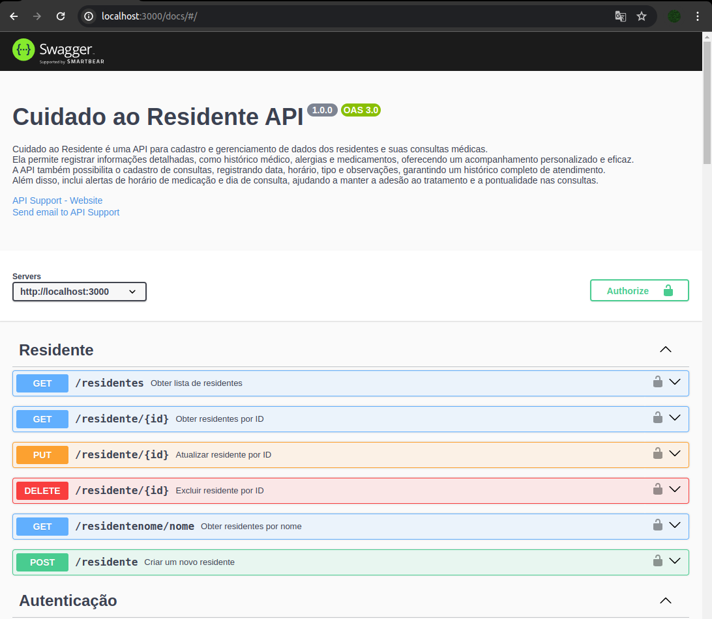
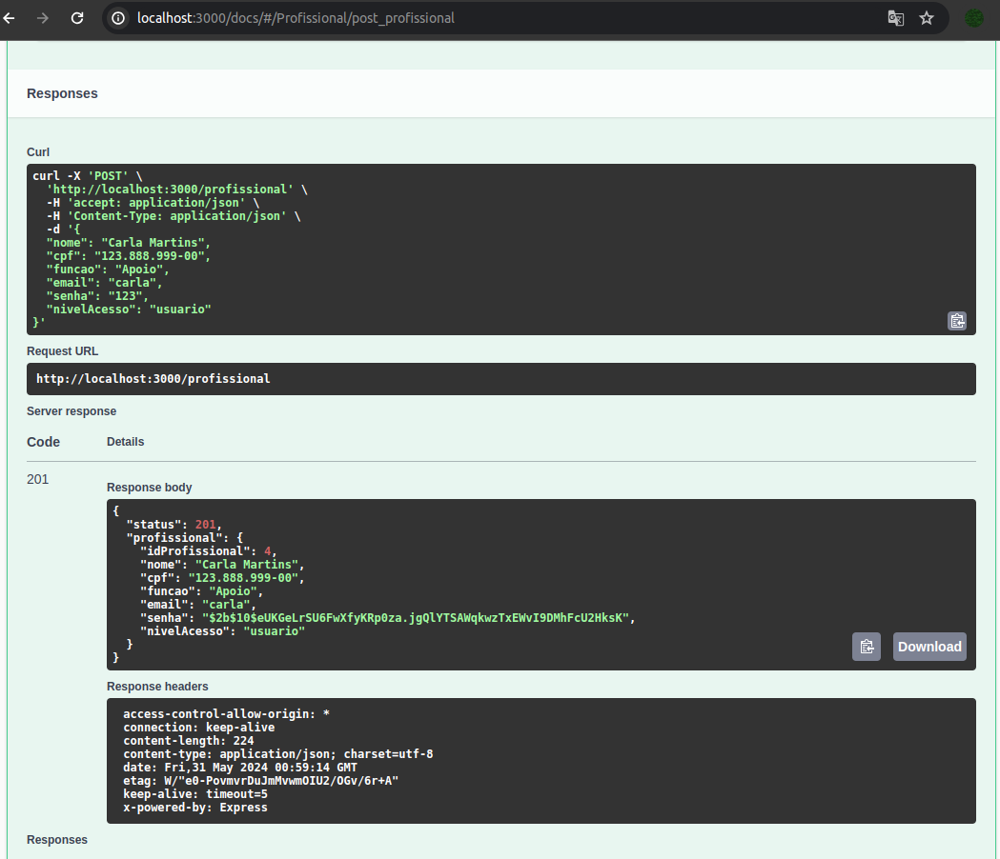
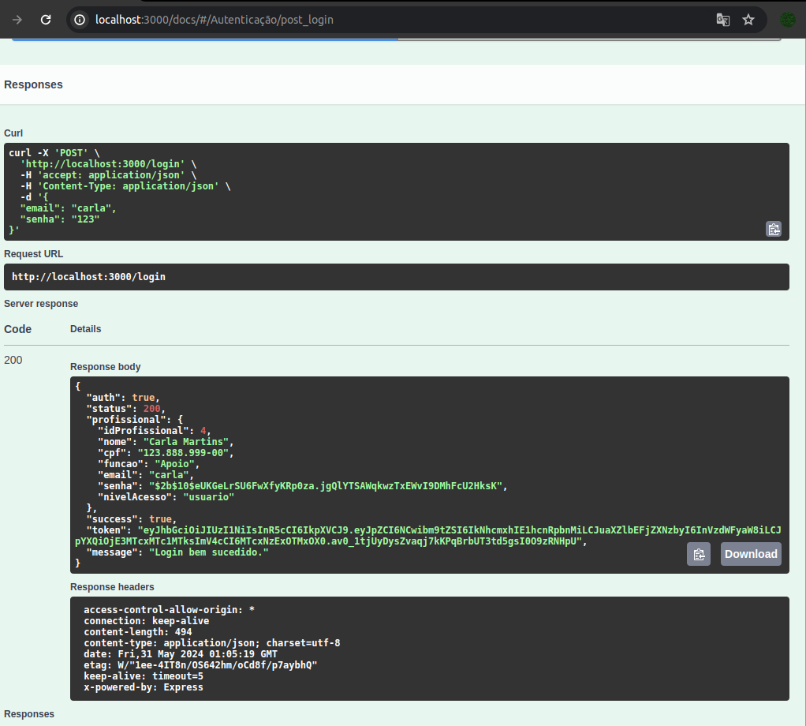
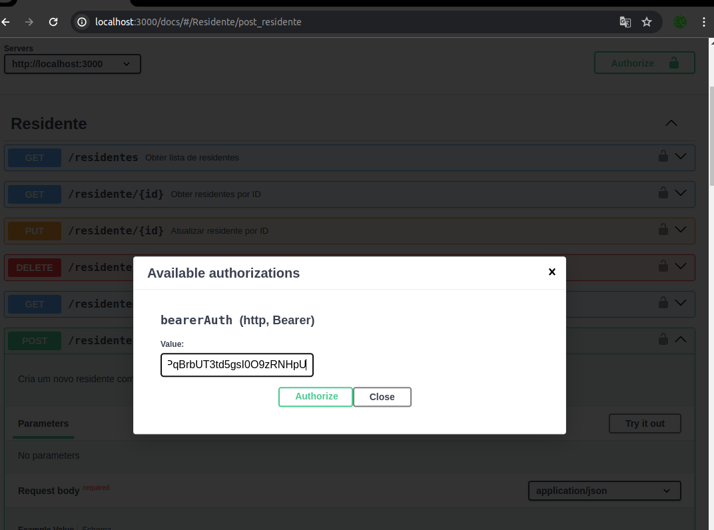
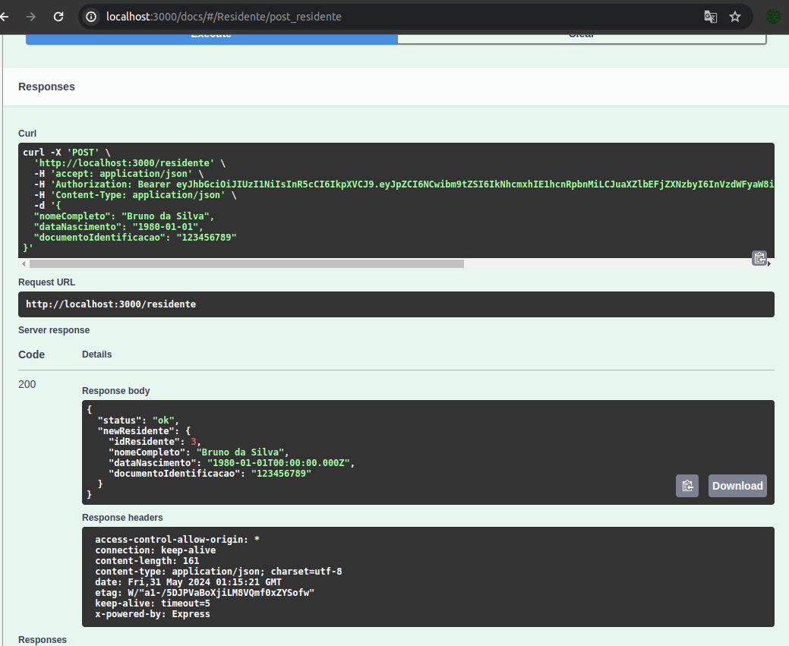
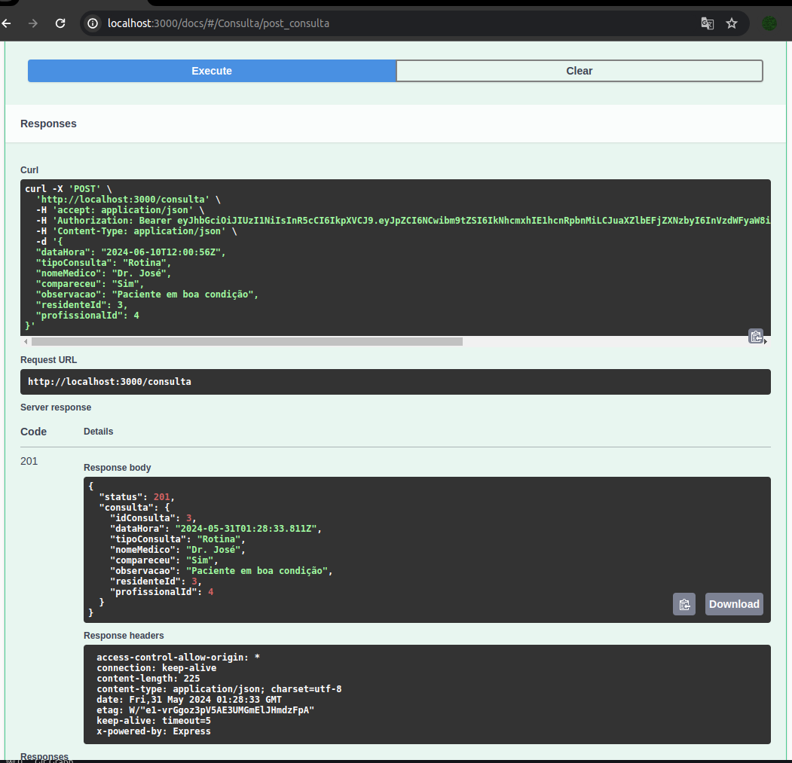
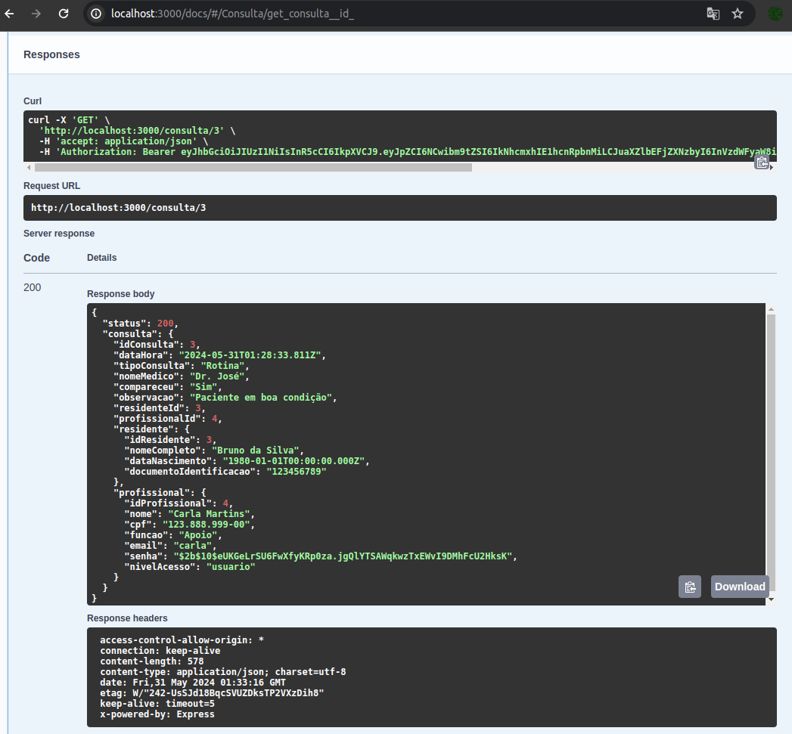
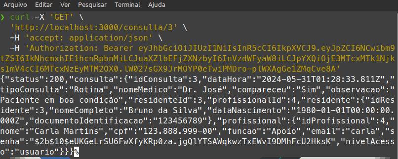
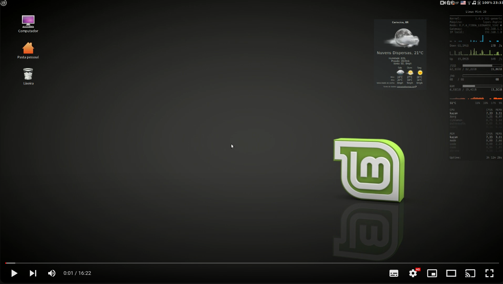
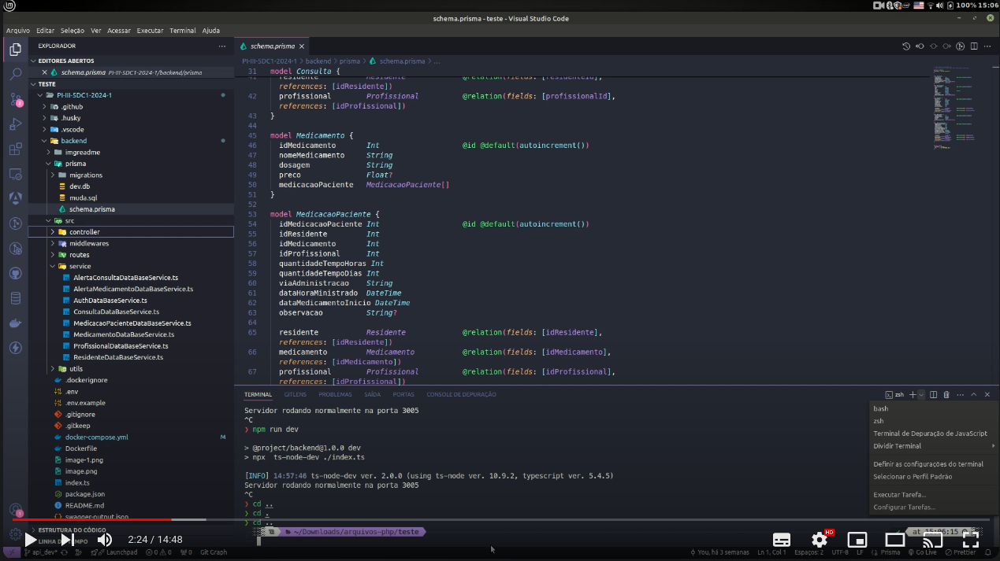

## 💻 Pré-requisitos

Antes de começar, verifique se você atendeu aos seguintes requisitos:

- Você instalou a versão mais recente do [`Node.js`](https://nodejs.org/en/download)
- Você instalou a versão mais recente do [`Git`](https://git-scm.com/downloads).

--- 
## Tecnologias Utilizadas 🔧

- Prisma ORM
- Visual Studio Code
- Thunder Client
- SQLite
- Node.js
- TypeScript
- Swagger
- JWT
- Docker


--- 


**Diretório  e Arquivos:** 📁
   -
```
 backend
        ├── docker-compose.yml
        ├── Dockerfile
        ├── imgreadme
        │   ├── imageconsulta.png
        │   ├── imageconsultavisu.png
        │   ├── imagedadosidoso.png
        │   ├── imagelogin.png
        │   ├── image.png
        │   ├── imageterminal.png
        │   ├── imagetoken.png
        │   └── Swagger.png
        ├── index.ts
        ├── package.json
        ├── prisma
        │   ├── dev.db
        │   ├── migrations
        │   │   ├── 20240520163936_add_prima_saii_bd
        │   │   │   └── migration.sql
        │   │   └── migration_lock.toml
        │   ├── muda.sql
        │   └── schema.prisma
        ├── README.md
        ├── src
        │   ├── controller
        │   │   ├── AlertaConsultaController.ts
        │   │   ├── AlertaMedicamentoController.ts
        │   │   ├── AuthController.ts
        │   │   ├── ConsultaController.ts
        │   │   ├── MedicacaoPacienteController.ts
        │   │   ├── MedicamentoController.ts
        │   │   ├── ProfissionalController.ts
        │   │   └── ResidenteController.ts
        │   ├── middlewares
        │   │   └── autorizacao.ts
        │   ├── routes
        │   │   ├── AlertaConsultaRoutes.ts
        │   │   ├── AlertaMedicamentoRoutes.ts
        │   │   ├── AuthRoutes.ts
        │   │   ├── ConsultaRoutes.ts
        │   │   ├── MedicacaoPacienteRoutes.ts
        │   │   ├── MedicamentoRoutes.ts
        │   │   ├── ProfissionalRoutes.ts
        │   │   └── ResidenteRoutes.ts
        │   ├── service
        │   │   ├── AlertaConsultaDataBaseService.ts
        │   │   ├── AlertaMedicamentoDataBaseService.ts
        │   │   ├── AuthDataBaseService.ts
        │   │   ├── ConsultaDataBaseService.ts
        │   │   ├── MedicacaoPacienteDataBaseService.ts
        │   │   ├── MedicamentoDataBaseService.ts
        │   │   ├── ProfissionalDataBaseService.ts
        │   │   └── ResidenteDataBaseService.ts
        │   └── utils
        │       └── ComparadorDiaHoras.ts
        ├── swagger-output.json
        ├── swagger.ts
        └── tsconfig.json
```

## 🚀 Rodando o Projeto

Para rodar o projeto, siga estas etapas:

1. Clone o repositório para o seu computador usando o seguinte comando:

    ```bash
    git clone https://github.com/howardroatti/PI-III-5DC1-2024-1.git
    ```

2. Navegue até o diretório do projeto:

    ```bash
    cd PI-III-5DC1-2024-1/backend
    ```

 # 🐳 Rodando Com Docker:
Se você tiver o Docker e o Docker Compose instalados, execute os seguintes comandos:


```bash
docker-compose up --build -d
 ```
Este comando irá construir as imagens do Docker e iniciar os contêineres em modo detached (em segundo plano).
para subir o contêineres:

```bash
docker compose up 
 ```
Se você não tiver o Docker instalado, siga para o passo 3 .
  
3. Execute o comando npm install para instalar todas as dependências do projeto:

 ```bash
    npm install package.json
 ```

4. Execute os comandos para gerar o banco de dados do Prisma com SQLite:

 ```bash
    npx prisma generate
    npx prisma migrate      
    npx prisma migrate --schema=./prisma/schema.prisma               
```
5. Execute um dos comandos abaixo,  npm run, dentro  da pasta backend, para api_dev para iniciar o servidor de desenvolvimento da API:

 ```bash
       npx ts-node-dev index.ts    
```
 ```bash
       npm run dev    
```
 ```bash
       npm run swagger    
```


Será iniciado um servidor local do frontend na seguinte URL:

```
http://localhost:3005/
```
## 📤 Documentação da Api via Swagger:
```
http://localhost:3005/docs
```



---

## 💼 Apresentação

API do  projeto de gerenciamento de consultas médicas! api aonde o profissionais  podem cadastrar novos profissionais, registrar informações sobre os Residentes sob seus cuidados e agendar consultas médicas.

## 🔧 Configuração e Utilização

### Cadastro de Novo Profissional


Para cadastrar um novo profissional, você pode utilizar a rota `/profissionais` com o método POST. Certifique-se de incluir as informações necessárias no corpo da solicitação, como nome, e-mail e senha.
```
http://localhost:3005/profissional
```


### Login de Profissional

Para efetuar o login de um profissional, utilize a rota `/login` com o método POST. Envie as credenciais de acesso (e-mail e senha) no corpo da solicitação para receber um token de autenticação.
```
http://localhost:3005/login
```


### Cadastro de Novo Residente 

Para cadastrar um novo residente, utilize a rota `/residentes` com o método POST. Forneça as informações requeridas no corpo da solicitação, como nome, data de nascimento e outras informações relevantes. Abrar o modal clicando no cadeado cole o token gerado

```
http://localhost:3005/residente
```
- adcione token gerado no login




- salvando dados do residente




### Agendamento de Consulta

Para agendar uma consulta, utilize a rota `/consultas` com o método POST. Certifique-se de incluir os detalhes da consulta, como data, hora, tipo de consulta e o ID do residente e do profissional associados.
```
http://localhost:3005/consulta
```
- nova consulta



```
http://localhost:3005/consulta/5
```
- visualizar consultas




## 🚫 Rotas Requerendo Autenticação

Todas as rotas, com exceção do cadastro de usuário e login, requerem autenticação via token JWT. <br> Para obter acesso às demais rotas, incluindo aquelas para listar, atualizar e excluir registros, é necessário enviar o token JWT no cabeçalho de autorização da solicitação.

Por exemplo, ao enviar uma solicitação GET para listar todas as consultas, você deve incluir o token JWT no cabeçalho da seguinte forma:

```
Authorization: Bearer SEU_TOKEN_JWT

curl -X 'GET' \
  'http://localhost:3000/consulta/3' \
  -H 'accept: application/json' \
  -H 'Authorization: Bearer SEU_TOKEN_JWT '

```
- Salvando pelo terninal



Certifique-se de obter o token JWT através do processo de login descrito anteriormente.<br>
Com estas instruções, você está pronto para começar a utilizar nossa API de gerenciamento de consultas médicas! 

--- 


## 📤 Enviando as modificações


1. **Clone o Repositório:**
   Abra o terminal e clone o repositório com o comando:
   ```bash
   git clone https://github.com/howardroatti/PI-III-5DC1-2024-1.git
   ```

2. **Entre no Diretório do Repositório:**
   Navegue para o diretório do repositório clonado:
   ```bash
   cd PI-III-5DC1-2024-1
   ```

3. **Faça Checkout para a Branch `api_dev`:**
   Mude para a branch `api_dev`:
   ```bash
   git checkout api_dev
   ```

4. **Crie uma Nova Branch:**
   Crie uma nova branch para suas alterações. Substitua `nome_da_sua_branch` por um nome descritivo para a nova branch:
   ```bash
   git checkout -b nome_da_sua_branch
   ```

5. **Faça Suas Alterações no Código:**
   Faça todas as modificações necessárias nos arquivos do projeto.

6. **Adicione as Alterações:**
   Adicione as alterações ao staging area:
   ```bash
   git add .
   ```

7. **Faça o Commit das Alterações:**
   Commit as alterações com uma mensagem descritiva:
   ```bash
   git commit -m "Descrição das alterações feitas"
   ```

8. **Atualize a Branch com as Últimas Alterações da `main`:**
   Primeiro, mude para a branch `main` e puxe as últimas alterações:
   ```bash
   git checkout main
   git pull origin main
   ```

   Em seguida, volte para a sua branch e mescle as alterações da `main`:
   ```bash
   git checkout nome_da_sua_branch
   git merge main
   ```

9. **Resolva Conflitos de Merge (se houver):**
   Se houver conflitos, resolva-os nos arquivos indicados. Após resolver, adicione os arquivos corrigidos:
   ```bash
   git add .
   git commit -m "Resolução de conflitos"
   ```

10. **Envie a Branch para o Repositório Remoto:**
    Envie sua branch criada para o repositório remoto:
    ```bash
    git push origin nome_da_sua_branch
    ```

11. **Crie um Pull Request:**
    Vá para o repositório no GitHub, clique no botão "Compare & pull request" que deve aparecer após o push. Caso contrário, vá para a aba "Pull requests" e clique em "New pull request".

12. **Preencha os Detalhes do Pull Request:**
    Preencha os detalhes do pull request, como título e descrição, e clique em "Create pull request".

13. **Notifique a Equipe:**
    Informe sua equipe ou a pessoa responsável para revisar e aprovar seu pull request.

##  Vídeo Explicação e uso da API Residentes
[](https://www.youtube.com/watch?v=JwbPxzj2liA)

##  Vídeo  Backend: Explicação de Como Clonar e Rodar o Projeto
[](https://www.youtube.com/watch?v=YoGSLDR713g)
